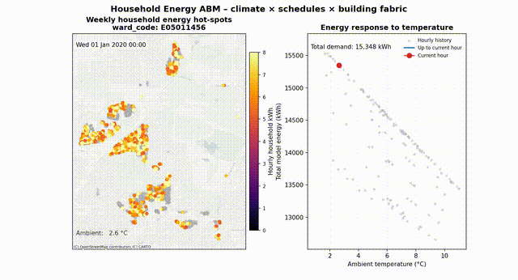

# Household Energy ABM (Mesa + mesa-geo)
[](https://doi.org/10.5281/zenodo.21356629)
[](LICENSE)

Simulates hour-by-hour residential energy demand for every dwelling in a GeoJSON, with validation against DESNZ subnational electricity & gas (2020–2023) and built-in policy levers (heat-pumps, retrofits, socio-demographic targeting).

An interactive demonstration of the main model features is available [here](https://alejandrobeltrana.github.io/spdt_abm/abm_demo.html).

---

## What’s new
- **Meter-anchored baseline:** fixed 0.40 kWh/h with mild area/property-type scaling; structural multipliers only affect heating. Baseline capped at 1.5 kWh/h.
- **Duty-cycle heating + caps:** sublinear area scaling, bounded property-type multipliers, 20 kWh/h total cap with per-component clip diagnostics.
- **Scenario testing v2:** ready-to-wire policy selectors (income/education, top users, kids vs elderly, social rent) documented in `docs/scenario_testing_v2_guide.md`.
- **DESNZ calibration notebook:** `notebooks/energy-model-validation.ipynb` compares ABM vs DESNZ per LSOA and exports batch runs.

---

## Directory map
```
household_energy/            # Core package
├── agent.py                 # Household/Person agents (baseline/heating logic)
├── model.py                 # EnergyModel (hourly step, caps, collectors)
├── run.py                   # CLI headless runner
├── analyze.py               # Post-run plots/maps
└── climate.py               # ClimateField helpers

notebooks/
├── energy-model-validation.ipynb    # DESNZ alignment, LSOA batch runs
├── household_energy_abm_tutorial.ipynb
├── policy_scenarios_detailed.ipynb  # Step-by-step policy scenario analysis
└── policy_scenarios_summary.ipynb   # All scenarios in one go, with maps

docs/
└── scenario_testing_v2_guide.md     # Dashboard-ready scenario guide

research/applied/            # Calibration + validation pipeline (Applied Energy paper)
├── scripts/                 # SERL fits, ledger, calibration + validation runners
├── notebooks/               # Calibration / sensitivity / validation / figures
└── RUNBOOK.md               # How to regenerate the config and promote it into the engine
```

---

## Setup
```bash
python -m venv .venv
source .venv/bin/activate   # Windows: .venv\Scripts\activate
pip install -r requirements.txt
# dev mode for CLI imports
pip install -e .
```

Inputs (git-ignored):
- Household GeoJSON with UPRN + EPC attributes (`data/epc_abm_*.geojson`)
- Hourly ERA5 climate parquet — two versions:
  - `data/ncc_2t_timeseries_2010_2026.parquet` — historical period for DESNZ validation
  - `data/ncc_2t_timeseries_2010_2039.parquet` — extended to 2039 for future scenario runs
- Optional HIDP enrichment CSV (`data/hidp_uprn_matches_tiered.csv`) — required for policy scenario cohort masks
- DESNZ Excel workbooks for validation (electricity + gas, per LSOA)

See `notebooks/README.md` for the recommended reading order and a map from notebook to paper section.

---

## Two layers: running the model vs. making it accurate

The repo is layered so the engine and the science that calibrates it stay separable, and the same engine carries forward to later papers.

- **`household_energy/` — the ABM engine ("how to run").** Everything you need to simulate hour-by-hour demand for a stock. It ships with `household_energy/calibrated_config.yaml`, the fitted parameters that make it accurate, and **every CLI entry point defaults to that config**. So with the data in `data/`, the model runs accurately out of the box, no calibration step and no extra flags. Pass `--config defaults` to run uncalibrated, or `--config <path>` to use a different calibration.

- **`research/applied/` — the Applied Energy paper ("how to make it accurate").** The calibration and validation pipeline that *produces* the shipped config: the six SERL fits, the `calibrate_serl.py` orchestrator, and the spatial-transfer validation. See [`research/applied/RUNBOOK.md`](research/applied/RUNBOOK.md). To regenerate the calibration and re-promote it into the engine:

  ```bash
  # 1. fit on the SERL panel (anchors + gas slope + building-type mults + the six fits)
  python research/applied/scripts/calibrate_serl.py --years 2023 --label v5_phase5b
  # 2. promote into the engine (ships the model block only, drops provenance/aliases)
  python research/applied/scripts/promote_config.py
  ```

  Later papers add their own analysis layer (scenarios, projections) on top of the same engine and the same shipped config.

---

## Running the model (CLI)
7-day smoke:
```bash
energy-run data/abm_households.geojson \
  --climate data/hourly_climate.parquet \
  --days 7 \
  --outdir results_smoke \
  --no-agent-level
```

Windowed (validation, 2020–2024):
```bash
energy-run data/abm_households.geojson \
  --climate data/hourly_climate.parquet \
  --start-utc 2020-01-01T00:00:00Z \
  --end-utc   2025-01-01T00:00:00Z \
  --outdir results_window
```
Flags of interest:
- `--hidp-csv` to merge socio-demographics
- `--agent-level/--no-agent-level` for per-dwelling collection
- `--print-every-hours` progress cadence

Outputs:
- `model_timeseries.parquet` (UTC hourly, model-level)
- `agent_timeseries.parquet` (if enabled; includes socio fields)
- `model_daily.parquet`, `model_hourly.parquet`
- `energy_timeseries.csv` (compat)
- `energy_model.pkl` (unless `--no-pickle`)

### LSOA batch (per-dwelling annuals, DESNZ-ready)
```bash
energy-run-lsoa \
  --geojson data/abm_households.geojson \
  --climate data/hourly_climate.parquet \
  --start-utc 2020-01-01T00:00:00Z \
  --end-utc   2025-01-01T00:00:00Z \
  --outdir results_lsoa
```
Outputs live under `results_lsoa/<LSOA>/run_<stamp>/` with `abm_year_<LSOA>_<stamp>.parquet/.csv` plus hourly model timeseries; a combined rollup is saved as `abm_year_all_<stamp>.*`.

### Visual teaser


---

## Key notebooks

See `notebooks/README.md` for the full reading order and paper section map.

- **Start here:** `notebooks/household_energy_abm_tutorial.ipynb` — MABM design, agent structure, climate coupling, and output collection.
- **Calibration:** `notebooks/serl_calibration_clean.ipynb` — model parameters derived analytically from SERL Smart Meter data.
- **Validation:** `notebooks/energy-model-validation.ipynb` — ABM vs DESNZ per-LSOA comparison (2020–2023).
- **Policy experiments:** `notebooks/policy_scenarios_detailed.ipynb` — step-by-step; `notebooks/policy_scenarios_summary.ipynb` — all scenarios + map.
- **Future projections:** `notebooks/full_run_example.ipynb` — 2020–2039 long-horizon run.

---

## Baseline & heating (model summary)
- Baseline: `0.40 kWh/h * (area/70)^0.20` clipped [0.85, 1.25] * property-type baseline multiplier (detached 1.20, semi 1.10, end 1.05, mid 1.00, flats 0.85–0.90); cap 1.5 kWh/h. No SAP/envelope/fuel scaling.
- Heating: duty-cycle on heat-loss signal; property-type heat multipliers (detached 1.20, semi 1.10, flats 0.85–0.90), sublinear area scaling, capped by capacity and global 20 kWh/h total cap. Diagnostics per dwelling: `base_kwh`, `heat_kwh`, `spike_kwh`, `cap_clip_*`.

---

## Policy levers (ready for UI)
- Heat-pump eligibility/class (`is_heatpump_candidate`, `heatpump_candidate_class`, adoption rate)
- Cohort masks: income band, education, tenure, children flag, schedule_type, dwelling_bucket, top-X% energy users
- Retrofit flags: `loft_ins_flag`, `glazing_flag`, etc.
- Setpoint tweak (e.g., elderly setback)

Reference implementations live in `notebooks/policy_scenarios_detailed.ipynb` (step-by-step) and `notebooks/policy_scenarios_summary.ipynb` (all scenarios + maps); both are documented in `docs/scenario_testing_v2_guide.md`.

---

## Validation vs DESNZ
Use `energy-model-validation.ipynb`:
- Load DESNZ electricity + gas, compute per-dwelling DESNZ kWh (elec meters as denominator).
- Load ABM batch parquet(s) from `results_lsoa/*/run_*/abm_year_*.parquet`.
- Compare per LSOA, per year: ABM kWh, DESNZ kWh, ratios; plot and export summaries.

---

## Support scripts
- `energy-run-lsoa` — CLI entry point for per-LSOA batches (agent-level optional), saves annual kWh by LSOA/year. Implemented in `household_energy/run_lsoa_batch.py`.
- `household_energy/make_animation.py` — helper for per-LSOA animated visualisations (optional).
- `research/applied/scripts/` — calibration + validation utilities: the SERL fits and ledger, figure generation, sensitivity (Morris), and spatial-transfer validation.

---

## Security
`data/` is git-ignored. Keep local inputs there; do not commit sensitive files.

---

## Citation
If you use this software, please cite it using the metadata in [`CITATION.cff`](CITATION.cff)
(GitHub renders a "Cite this repository" button from it). Each release is archived on Zenodo:

- **Cite all versions (concept DOI):** [10.5281/zenodo.21356629](https://doi.org/10.5281/zenodo.21356629)
- **This release (v1.0.0):** [10.5281/zenodo.21356630](https://doi.org/10.5281/zenodo.21356630)

This work is part of the wider DestinE SPDT project ([10.5281/zenodo.21340939](https://doi.org/10.5281/zenodo.21340939)).

---

## License
MIT — see [`LICENSE`](LICENSE). © 2025 The Alan Turing Institute.
